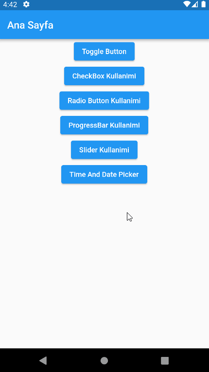

#### Toggle Button - CheckBox - Radio Button Kullanimi

#### ProgressBar - Slider Kullanimi

#### Time And Date Picker Kullanimi

#### DropDown Button Kullanimi

#### SnackBar - Alert Dialog Kullanimi

